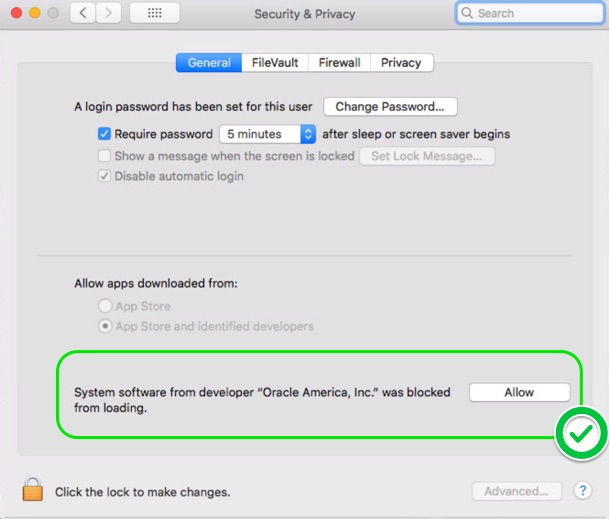

# MariaDB Kubernetes MaxScale Master Slave using StatefulSets

## Overview

This directory contains kubernetes stateful set scripts to install a 3 node master slave cluster fronted by an Active/Passive pair of MaxScale nodes. The cluster can be deployed using helm or alternatively using shell / powershell kubectl wrapper scripts. The scripts should be considered alpha quality at this stage and is not recommended for production deployments.  

## Local Kubernetes Installations

The scripts can be deployed against a cloud kubernetes deployment such as Google Kubernetes Engine or alternatively using one of several local vm based kubernetes frameworks such as minikube for Windows and Mac or microk8s for Ubuntu / Linux.

### Installing microk8s on Ubuntu

**microk8s** is a lightweight kubernetes install that can be installed using the cross platform snap utility but most optimally on Ubuntu.

The following steps will install microk8s, helm, and configure it for dns, dashboard, and storage:

```sh
sudo snap install microk8s --beta --classic
sudo snap install helm --classic
sudo snap install kubectl --classic
microk8s.enable dns dashboard storage
helm init
```

After installation the kubernetes dashboard application may be accessed at:
http://localhost:8080/api/v1/namespaces/kube-system/services/https:kubernetes-dashboard:/proxy

### Installing minikube on Windows 10

- If you are running Windows 10 Professional enable Hyper-V virtualization. For other versions install VirtualBox as the virtualization software.
- Download minikube for windows from: https://github.com/kubernetes/minikube/releases and rename to minikube.exe and add to a directory in your path.
- Download kubectl and add to the same directory, using the latest link here:https://kubernetes.io/docs/tasks/tools/install-kubectl/#install-kubectl-binary-using-curl
- Download helm and tiller and add to the same directory: https://github.com/helm/helm/releases
- If you are utilizing Hyper-V, create an external switch in hyper-v virtual switch manager named ExternalSwitch configured to use external networking.

To initialize minikube for VirtualBox:

```sh
minikube start
```

To initialize minikube for Hyper-V:

```sh
minikube start --vm-driver hyperv --hyperv-virtual-switch "ExternalSwitch"
```

After installation the kubernetes dashboard application may be accessed by running:

```sh
minikube dashboard
```

To initialize helm:

```sh
helm init
```

### Installing minikube on MacOS X (High Sierra)

#### Install Homebrew

Homebrew is a external package manager for OSX it is required for the installation of some of the components below.(Homebrew is not the only way to install those for more information refer to [Other ways to install k8s](https://kubernetes.io/docs/tasks/tools/install-kubectl/#install-with-macports-on-macos)

Open your Terminal app. Press cmd+space and type terminal.app

Type the following command in the terminal window.

```$ /usr/bin/ruby -e “$(curl -fsSL https://raw.githubusercontent.com/Homebrew/install/master/install)”```

This will start Homebrew installation (Xcode Command Line Tools are a dependency which will be installed or updated in the process).

#### Install Hypervisor

A hypervisor is required for the Kubectl to work on OSX. the popular options are  VirtualBox or VMware Fusion, or HyperKit. This guide will do the installations with VirtualBox

##### VirtualBox

Download the [VirtualBox for OSX](https://download.virtualbox.org/virtualbox/5.2.18/VirtualBox-5.2.18-124319-OSX.dmg) package and follow the instructions. OSX may require allowing this package in security & privacy section.



[Other Install Options](https://www.virtualbox.org/wiki/Downloads)

#### Install Kubernetes command-line tool (kubectl)

Install kubectl by typing the following Homebrew command in a terminal window.

```$ brew install kubernetes-cli```

#### Install Minikube

Install minikube by typing the following Homebrew command in a terminal window.

```bash
curl -Lo minikube https://storage.googleapis.com/minikube/releases/v0.28.2/minikube-curl -Lo minikube https://storage.googleapis.com/minikube/releases/v0.28.2/minikube-darwin-amd64 && chmod +x minikube && sudo mv minikube /usr/local/bin/
```

You can also use another version of [minikube](https://github.com/kubernetes/minikube/releases).

#### Start Minikube

Minikube can be started using the following command

```sh
minikube start
```

To stop the cluster use:

```sh
minikube stop
```

## Running the Master Slave plus MaxScale Cluster

### Installation Prerequisites

It is highly advisable to have an NFS server set up in order to use the backup and restore functionality provided. Here is a simple NFS server example running in Kubernetes that can be used for testing. For production, an NFS server that doesn't live in Kubernetes might be a better approach.

```yaml
apiVersion: v1
kind: Pod
metadata:
  name: nfs-test
  labels:
    app: nfs-test
spec:
  containers:
  - name: nfs
    image: itsthenetwork/nfs-server-alpine
    env:
    - name: SHARED_DIRECTORY
      value: /nfs
    volumeMounts:
    - name: data
      mountPath: /nfs
    securityContext:
      privileged: true
  volumes:
  - name: data
    emptyDir: {}
```

To use the above code, save it in an `.yaml` file (for example `nfs-test.yaml`). Then run the following command:

```sh
  kubectl create -f nfs-test.yaml
```

You can then find the NFS server's IP by running

```sh
  kubectl describe pod nfs-test
```

### Installing the Cluster with Helm

Helm provides a simple means of installation and is the *recommended* approach. To install the cluster simply run specifying a unique id which is used as the release name as well as name prefix for other objects:

```sh
helm install . --name <id>
```

To review installed releases:

```sh
helm list
```

To remove a helm release:

- if just you want to delete the cluster (You can't use the same cluster `<id>` in the future)

  ```sh
  helm delete <id>
  ```

- if you want to delete the cluster and delete it's name from the Helm cache (this will allow you to reuse the same `<id>` again)

  ```sh
  helm delete <id> --purge
  ```

The cluster topology can be specified by changing the `mariadb.cluster.topology` value in the `values.yaml` file or directly overriding it when running the `helm` command:

- with NFS connection (allows to perform backup in the future)

  ```sh
  helm install . --name <id> --set mariadb.cluster.topology=masterslave --set mariadb.server.backup.nfs.server=<NFS_SERVER_IP>
  ```

- without NFS connection (the build in backup functionality can't be used)

  ```sh
  helm install . --name <id> --set mariadb.cluster.topology=masterslave
  ```

Possible values are `masterslave`, `standalone` and `galera`. Default is `masterslave`.  
Any value in the `values.yaml` file can be overridden this way.  

## Parameterization

The following list of parameters can be used with the helm chart by either modifying the file `values.xml` or through the command line switch `--set <parameter name>=<value>`:

| Parameter                                  | Default                  | Description                                                                                                         |
|--------------------------------------------|--------------------------|---------------------------------------------------------------------------------------------------------------------|
| _Global for the cluster_                                                                                                                                                                    |
| mariadb.cluster.id                         | null                     | A generated unique ID of the cluster (used as a label on all artefacts) for discovery in multi-tenant environments. |
| Mariadb.cluster.topology                   | masterslave              | The type of cluster to create, one of: masterslave, galera, standalone                                       |
| mariadb.cluster.labels                     | null                     | An associative array of custom labels in format name:value added to the cluster endpoint                            |
| mariadb.cluster.annotations                | null                     | An associative array of custom annotations added to each pod in the topology                                        |
| _Server instances_                         |                          |                                                                                                                     |
| mariadb.server.users.admin.username        | admin                    | MariaDB admin user                                                                                                  |
| mariadb.server.users.admin.password        | 5LVTpbGE2cGFtw69         | MariaDB admin password                                                                                              |
| mariadb.server.users.replication.username  | repl                     | Replication user name                                                                                                |
| mariadb.server.users.replication.password  | 5LVTpbGE2cGFtw69         | Replication user password                                                                                           |
| mariadb.server.storage.class               | null                     | Storage class specification of data volume                                                                          |
| mariadb.server.storage.size                | 256Mi                    | Size of data volume                                                                                                 |
| mariadb.server.replicas                    | 3                        | Number of server instances in Master/Slave and Galera topologies. Fixed at 1 in Standalone topology.                |
| mariadb.server.image                       | mariadb/server:10.3      | Name of Docker image for MariaDB Server                                                                             |
| mariadb.server.port                        | 3306                     | TCP/IP port on which each MariaDB Server instance exposes a SQL interface.                                          |
| mariadb.server.labels                      | null                     | An associative array of custom labels in format name:value added to Server pods only                                |
| mariadb.server.annotations                 | null                     | An associative array of custom annotations in format name:value added to Server pods only                           |
| mariadb.server.resources.requests.cpu      | null                     | The requested share of CPU for each Server pod                                                                      |
| mariadb.server.resources.requests.memory   | null                     | The requested memory for each Server pod                                                                            |
| mariadb.server.resources.limits.cpu        | null                     | The maximum share of CPU for each Server pod                                                                        |
| mariadb.server.resources.limits.memory     | null                     | The maximum share of memory for each Server pod                                                                     |
| mariadb.server.backup.nfs.server           | null                     | Backup NFS server host                                                                                              |
| mariadb.server.backup.nfs.path             | /                        | Backup NFS server path to mount                                                                                     |
| mariadb.server.backup.nfs.restoreFrom      | null                     | Subdirectory to use to restore the database on initial startup                                                      |
| _MaxScale instances_                       |                          |                                                                                                                     |
| mariadb.maxscale.image                     | mariadb/maxscale:2.2     | Name of Docker image for MaxScale                                                                                   |
| mariadb.maxscale.ports.readonly            | 4008                     | TCP/IP port on which the cluster instance exposes a read-only SQL interface through a service endpoint.             |
| mariadb.maxscale.ports.readwrite           | 4006                     | TCP/IP port on which the cluster instance exposes a read-write SQL interface through a service endpoint.            |
| mariadb.maxscale.labels                    | null                     | An associative array of custom labels in format name:value added to MaxScale pods only                              |
| mariadb.maxscale.annotations               | null                     | An associative array of custom annotations in format name:value added to MaxScale pods only                         |
| mariadb.maxscale.replicas                  | 2                        | Number of MaxScale instances in Master/Slave and Galera topologies.                                                 |
| mariadb.maxscale.resources.requests.cpu    | null                     | The requested share of CPU for each MaxScale pod                                                                    |
| mariadb.maxscale.resources.requests.memory | null                     | The requested memory for each MaxScale pod                                                                          |
| mariadb.maxscale.resources.limits.cpu      | null                     | The maximum share of CPU for each MaxScale pod                                                                      |
| mariadb.maxscale.resources.limits.memory   | null                     | The maximum share of memory for each MaxScale pod                                                                   |
| *StateStore instances*                     |                          |                                                                                                                     |
| mariadb.statestore.image                   | mariadb/statestore:0.0.3 | Name of Docker image for MariaDB StateStore                                                                         |

Refer to https://kubernetes.io/docs/concepts/configuration/manage-compute-resources-container/#resource-requests-and-limits-of-pod-and-container for the definition of resource requests and limits.

## Using the cluster

To access the MaxScale node locally, find the ip address of the service:

```sh
kubectl get services
```

The output will look something like:

```sh
NAME            TYPE        CLUSTER-IP       EXTERNAL-IP   PORT(S)             AGE
kubernetes      ClusterIP   10.152.183.1     <none>        443/TCP             40m
msl-mariadb     ClusterIP   10.152.183.135   <none>        4006/TCP,4008/TCP   28m
msl-mdb-clust   ClusterIP   None             <none>        3306/TCP            28m
msl-mdb-state   ClusterIP   10.152.183.129   <none>        80/TCP              28m
```

Use the `CLUSTER-IP` for `<release>-mariadb` as the host to connect to. The following ports are mapped to the local host:

- 4006: MaxScale ReadWrite Listener
- 4008: MaxScale ReadOnly Listener

After this (the user and password comes from the helm chart values.yaml):

```sh
mysql -urepl -p5LVTpbGE2cGFtw69 -P4006 -h <cluster-ip>
mysql -urepl -p5LVTpbGE2cGFtw69 -P4008 -h <cluster-ip>
```

Applications deployed in the same namespace in Kubernetes can also access the cluster using the hostname `<prefix>-mariadb`.

## Using the Backup/Restore functionality

You can backup an already running cluster or initialize a new cluster with an existing backup

### Backup

#### Backup Prerequisites

You need a running MariaDB cluster connected to an NFS server.  
The `Installation Prerequisites` and `Installing the Cluster with Helm` sections contain more information about this.

#### Backup procedure

run in terminal

```sh
kubectl exec -it <name_of_the_pod_to_backup> -- bash /mnt/config-map/backup-save.sh
```

Near the start of the log you can find the name of the folder where your backup will be stored on the NFS server. The format is `backup-<pod-name>-<backup_date>`.

### Restore

You can use an existing backup and load it when starting a new cluster. Restoring always creates a new cluster. Restoring into a running cluster is not possible.

#### Restore Prerequisites

- an existing backup located in an NFS volume

#### Restore procedure

1. Change these values in the values.yaml file:
    - `mariadb.server.backup.restoreFrom` should point to the exact directory containing the backup.
    - `mariadb.server.backup.nfs.server` should be the IP of hostname of the NFS server
    - `mariadb.server.backup.nfs.path` should be the NFS mount point (optional, default is `"/"`)
2. Start the cluster as you would normally using
    ```sh
    helm install .
    ```
3. The above as a single command:
    ```sh
    helm install . --name <id> --set mariadb.server.backup.restoreFrom=<backup_path> --set mariadb.server.backup.nfs.server=<nfs_server_ip> --set mariadb.server.backup.nfs.path=<nfs_mount_point>
    ```